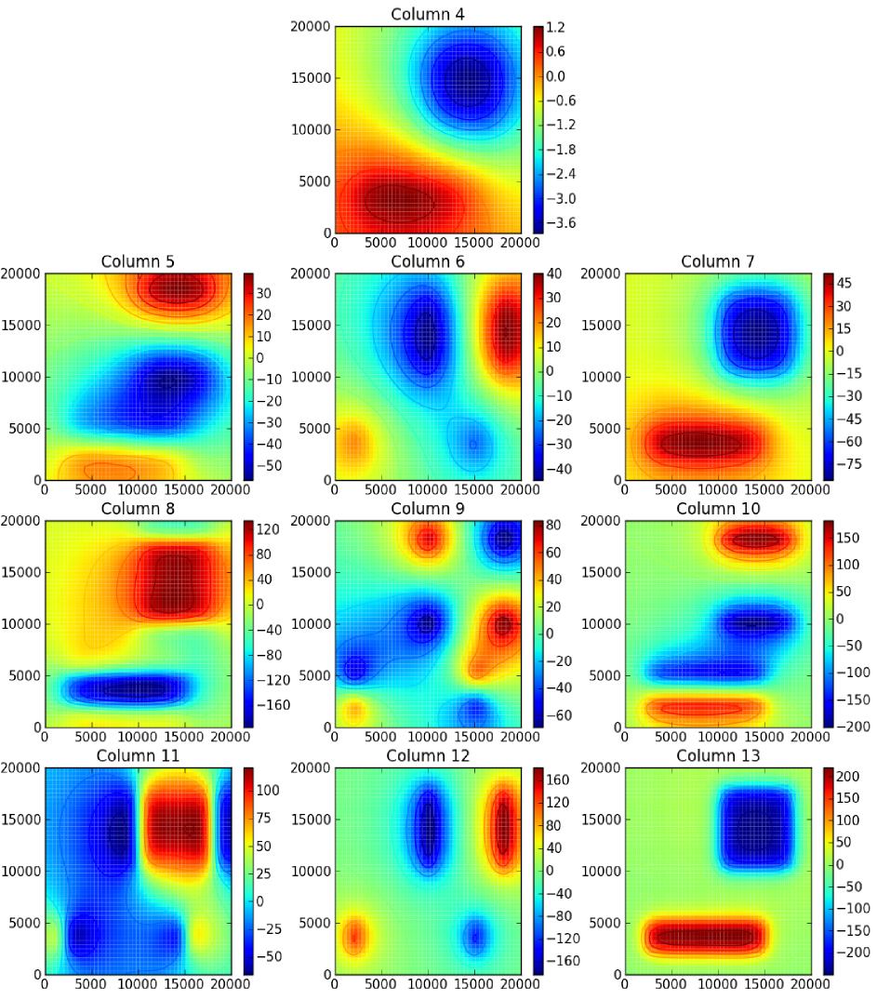

.. _cookbook:

Cookbook
========

The following recipes can be found in the ``cookbook`` folder
that comes with your *Tesseroids* download
(along with scripts and sample output).
    

Simple tesseroid model
----------------------

The ``simple_tess.sh`` script calculates
the gravitational potential, gravitational attraction,
and gravity gradient tensor due to a simple tesseroid model:

.. include:: ../cookbook/simple_tess/simple_tess.sh
    :literal:

The model file looks like this:

.. include:: ../cookbook/simple_tess/model.txt
    :literal:

The result should look like the following
("column" means the column of the output file):

.. figure:: ../cookbook/simple_tess/simple_tess.png
    :align: center
    :width: 600px
    
    Plot of the columns of ``output.txt`` generated by ``simple_tess.sh``.
    The x and y axis are longitude and latitude, respectively.

    
Simple prism model in Cartesian coordinates
-------------------------------------------

The ``simple_prism.sh`` script calculates
the gravitational potential, gravitational attraction,
and gravity gradient tensor due to a simple prism model
in Cartesian coordinates:

.. include:: ../cookbook/simple_prism/simple_prism.sh
    :literal:

The model file looks like this:

.. include:: ../cookbook/simple_prism/model.txt
    :literal:

The result should look like the followning
("column" means the column of the output file):

    Plot of the columns of ``output.txt`` generated by ``simple_prism.sh``.
    The x and y axis are longitude and latitude, respectively.

    
Convert a tesseroid model to prisms and calculate in Cartesian coordinates
--------------------------------------------------------------------------

The ``tess2prism_flatten.sh`` script
converts a tesseroid model to prisms
(using the ``--flatten`` flag in ``tessmodgen``) and
calculates the gravitational potential, gravitational attraction,
and gravity gradient tensor
in Cartesian coordinates:

.. include:: ../cookbook/tess2prism_flatten/tess2prism_flatten.sh
    :literal:

The tesseroid model file looks like this:

.. include:: ../cookbook/tess2prism_flatten/tess-model.txt
    :literal:

and the converted prism model looks like this:

.. include:: ../cookbook/tess2prism_flatten/sample-prism-model.txt
    :literal:

Note that the density of prisms is altered.
This is so that the tesseroid and corresponding prism have the same mass.

The result should look like the following
("column" means the column of the output file):

.. figure:: ../cookbook/tess2prism_flatten/tess2prism_flatten.png
    :align: center
    :width: 600px

    Plot of the columns of ``output.txt`` generated
    by ``tess2prism_flatten.sh``.
    The x and y axis are West-East and South-North, respectively, in kilometers.
