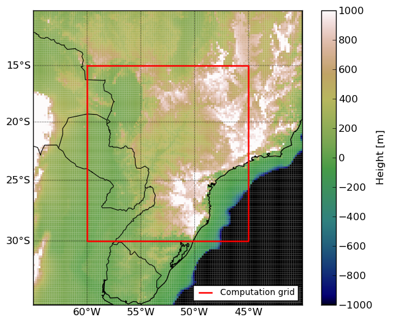
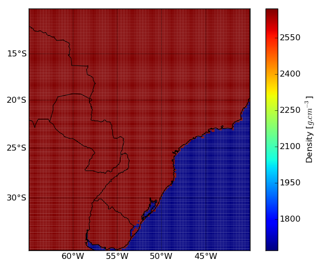
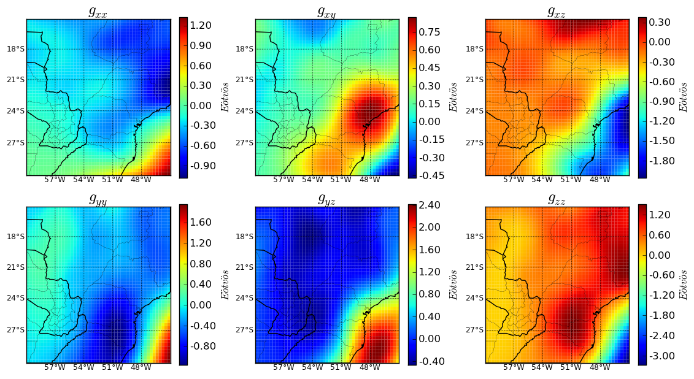

.. _dem-brasil:

Calculate the gravity gradient tensor from a DEM
================================================

This example demonstrates how to calculate
the gravity gradient tensor (GGT) due to
topographic masses using tesseroids.

To do that we need:
    
#. A DEM file with lon, lat, and height information;
#. Assign correct densities to continents and oceans (we'll be using a little Python for this);
#. Convert the DEM information into a tesseroid model;
#. Calculate the 6 components of the GGT;

The file ``dem_brasil.sh`` is a small shell script
that executes all the above
(we'll be looking at each step in more detail):

.. include:: ../../cookbook/dem_brasil/dem_brasil.sh
    :literal:
    :number-lines:

Why Python
----------

Python is a modern programming language
that is very easy to learn and extremely productive.
We'll be using it to make our lives a bit easier
during this example but it is by no means a necessity.
The same thing could have been accomplished
with Unix tools and the `Generic Mapping Tools`_ (GMT)
or other plotting program.

If you have interest in learning Python
we recommend the excelent video lectures
in the `Software Carpentry`_ course.
There you will also find lectures
on various scientific programming topics.
I strongly recommend taking this course
to anyone who works with scientific computing.

.. _Generic Mapping Tools: http://www.soest.hawaii.edu/gmt
.. _Software Carpentry: http://software-carpentry.org

The DEM file
------------

For this example we'll use ETOPO1_ for our DEM.
The file ``dem.xyz`` contains the DEM as a 10' grid.
Longitude and latitude are in decimal degrees
and heights are in meters.
This is what the DEM file looks like (first few lines):

.. include:: ../../cookbook/dem_brasil/dem.xyz
    :literal:
    :number-lines:
    :end-line: 10

Notice that *Tesseroids* allows you to include
comments in the files by starting a line with ``#``.
:ref:`This figure <dem>`
shows the DEM ploted in pseudocolor.
The red rectangle is the area
in which we'll be calculating the GGT.

.. _dem:

    The ETOPO1 10' DEM of the Parana Basin, southern Brasil.

.. _ETOPO1: http://www.ngdc.noaa.gov/mgg/global/global.html

Assigning densities
-------------------

Program tessmodgen allows us
to provide the density value of each tesseroid
through the DEM file.
All we have to do is insert an extra column
in the DEM file with the density values
of the tesseroids that will be put on each point.
This way we can have
the continents with 2.67 g/cm3
and oceans with 1.67 g/cm3.
Notice that the density assigned to the oceans
is positive!
This is because the DEM in the oceans
will have heights bellow our reference (h = 0km)
and tessmodgen will automatically invert
the sign of the density values if a point is bellow the reference.

We will use the Python script ``dem_density.py``
to insert the density values into our DEM
and save the result to ``dem-dens.txt``:

.. include:: ../../cookbook/dem_brasil/dem_brasil.sh
    :literal:
    :number-lines: 3
    :start-line: 2
    :end-line: 5

If you don't know Python,
you can easily do this step in any other language
or even in Excel.
This is what the ``dem_density.py`` script looks like:

.. include:: ../../cookbook/dem_brasil/dem_density.py
    :code: python
    :number-lines:

The result is a DEM file with a forth column
containing the density values
(see :ref:`this figure <dem-dens>`):

.. include:: ../../cookbook/dem_brasil/sample-dem-dens.txt
    :literal:
    :number-lines:
    :end-line: 10

.. _dem-dens:

    Density values. 2.67 g/cm3 in continents and 1.67 g/cm3 in the oceans.

Making the tesseroid model
--------------------------

Next, we'll use our new file ``dem-dens.txt``
and program tessmodgen to create
a tesseroid model of the DEM:

.. include:: ../../cookbook/dem_brasil/dem_brasil.sh
    :literal:
    :number-lines: 7
    :start-line: 6
    :end-line: 10

tessmodgen places a tesseroid on each point of the DEM.
The bottom of the tesseroid is placed on a reference level
and the top on the DEM.
If the height of the point is bellow the reference,
the top and bottom will be inverted
so that the tesseroid isn't upside-down.
In this case,
the density value of the point
will also have its sign changed
so that you get the right density values
if modeling things like the Moho.
For topographic masses,
the reference surface is h = 0km (argument ``-z``).
The argument ``-s`` is used
to specify the grid spacing (10')
which will be used to set
the horizontal dimensions of the tesseroid.
Since we didn't pass the ``-d`` argument
with the density of the tesseroids,
tessmodgen will expect a fourth column
in the input with the density values.

The result is a tesseroid model file
that should look somthing like this:

.. include:: ../../cookbook/dem_brasil/sample-dem-tess.txt
    :literal:
    :number-lines:
    :end-line: 10

and for the points in the ocean (negative height):

.. include:: ../../cookbook/dem_brasil/sample-dem-tess.txt
    :literal:
    :number-lines: 9065
    :start-line: 9064
    :end-line: 9065
    

Calculating the GGT
-------------------

*Tesseroids* allows use of custom computation grids
by reading the computation points from standard input.
This way,
if you have a file with lon, lat, and height coordinates
and wish to calculate any gravitational field in those points,
all you have to do is redirect stardard input to that file
(using ``<``).
All tess* programs will calculate their respective field,
append a column with the result to the input
and print it to stdout.
So you can pass grid files
with more than three columns,
as long as the first three
correspond to lon, lat and height.
This means that you can pipe the results
from one tessg to the other
and have an output file with many columns,
each corresponding to a gravitational field.
The main advantage of this approach is that,
in most shell environments,
the computation of pipes is done in parallel.
So, if your system has more than one core,
you can get parallel computation of GGT components
with no extra effort.

For convience,
we added the program tessgrd to the set of tools,
which creates regular grids and print them to standard output.
So if you don't want to compute on a custom grid (like us),
you can simply pipe the output of tessgrd to the tess* programs:

.. include:: ../../cookbook/dem_brasil/dem_brasil.sh
    :literal:
    :number-lines: 12
    :start-line: 11
    :end-line: 22

The end result of this is file ``dem-ggt.txt``,
which will have 9 columns in total.
The first three are the lon, lat and height coordinates
generated by tessgrd.
The next six will correspond to each component
of the GGT calculated by tessgxx, tessgxy, etc., respectively.
The resulting GGT is shown in :ref:`this figure <dem-ggt>`.

.. _dem-ggt:

    GGT of caused by the topographic masses.

Making the plots
----------------

The plots were generated using
the powerfull Python library Matplotlib_.
The script ``plots.py`` is somewhat more complicated than ``dem_density.py``
and requires a bit of "Python Fu".
The examples in the Matplotlib website
should give some insight into how it works.
To hanble the map projections,
we used the `Basemap toolkit`_ of Matplotlib.

.. _Matplotlib: http://matplotlib.sourceforge.net/index.html
.. _Basemap toolkit: http://matplotlib.sourceforge.net/basemap/doc/html/
