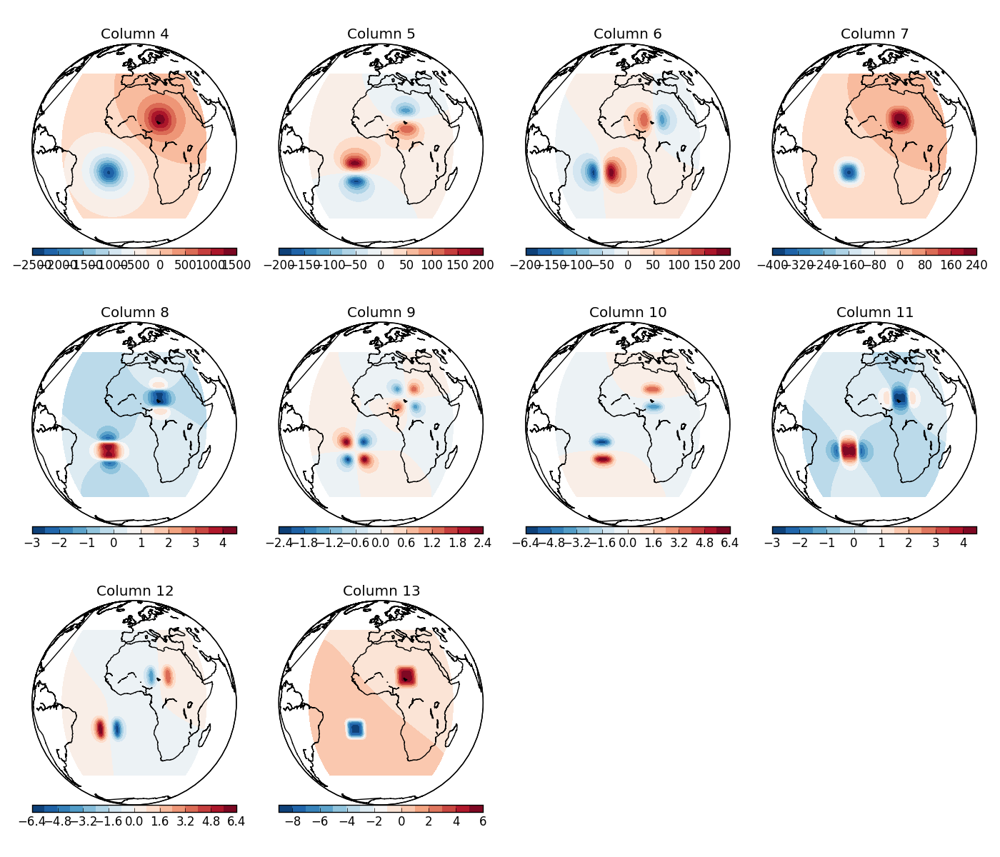

Simple tesseroid model
======================

The ``simple_tess.sh`` script calculates
the gravitational potential, gravitational attraction,
and gravity gradient tensor due to a simple tesseroid model:

.. include:: ../../cookbook/simple_tess/simple_tess.sh
    :literal:

Option ``-v`` tells tessgzz
to print information messages (to stderr).
Option ``-llog.txt`` tells tessgzz
to log the information plus debug messages
to a file called ``log.txt``.

The model file looks like this:

.. include:: ../../cookbook/simple_tess/model.txt
    :literal:

You will notice that this takes
considerably more time to compute
than a :ref:`simple 2 prism model <recipe_simple_prism>`.
This is because *Tesseroids* has to
recursively divide each tesseroid
into smaller tesseroids
in order to maintain the accuracy
of the :ref:`numerical integration <theory>`.
If you have a look at ``log.txt``,
you'll notice that the 2 tesseroids
were divided approximately 360,000 times
in total.
Don't worry,
this only happened because the tesseroids
are extremely large.

The result should look like the :ref:`following <simpletess>`
("column" means the column of the output file).

.. _simpletess:

    
    Plot of the columns of ``output.txt`` generated by ``simple_tess.sh``.
    Orthographic projection
    (thanks to the Basemap_ toolkit of matplotlib_).

.. _Basemap: http://matplotlib.github.com/basemap/index.html
.. _matplotlib: http://matplotlib.sourceforge.net/index.html
