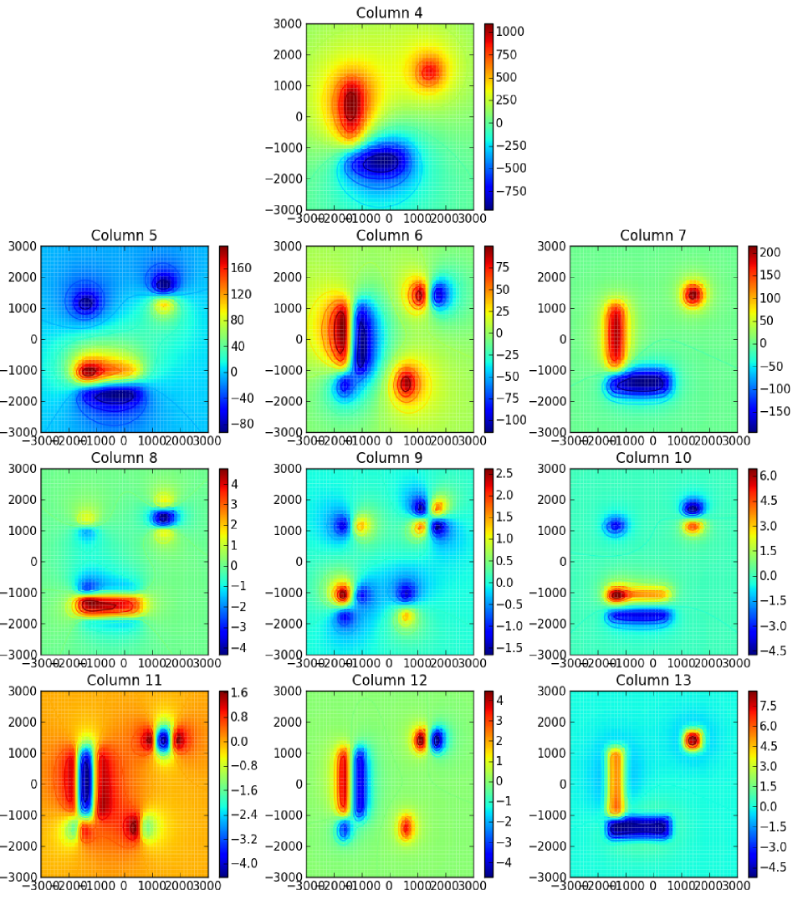

  
Convert a tesseroid model to prisms and calculate in Cartesian coordinates
==========================================================================

The ``tess2prism_flatten.sh`` script
converts a tesseroid model to prisms
(using the ``--flatten`` flag in ``tessmodgen``) and
calculates the gravitational potential, gravitational attraction,
and gravity gradient tensor
in Cartesian coordinates:

.. include:: ../../cookbook/tess2prism_flatten/tess2prism_flatten.sh
    :literal:

The tesseroid model file looks like this:

.. include:: ../../cookbook/tess2prism_flatten/tess-model.txt
    :literal:

and the converted prism model looks like this:

.. include:: ../../cookbook/tess2prism_flatten/sample-prism-model.txt
    :literal:

Note that the density of prisms is altered.
This is so that the tesseroid and corresponding prism have the same mass.

The result should look like the :ref:`following <tess2prism_flatten>`
("column" means the column of the output file).

.. _tess2prism_flatten:

    Plot of the columns of ``output.txt`` generated
    by ``tess2prism_flatten.sh``.
    The x and y axis are West-East and South-North, respectively, in kilometers.
