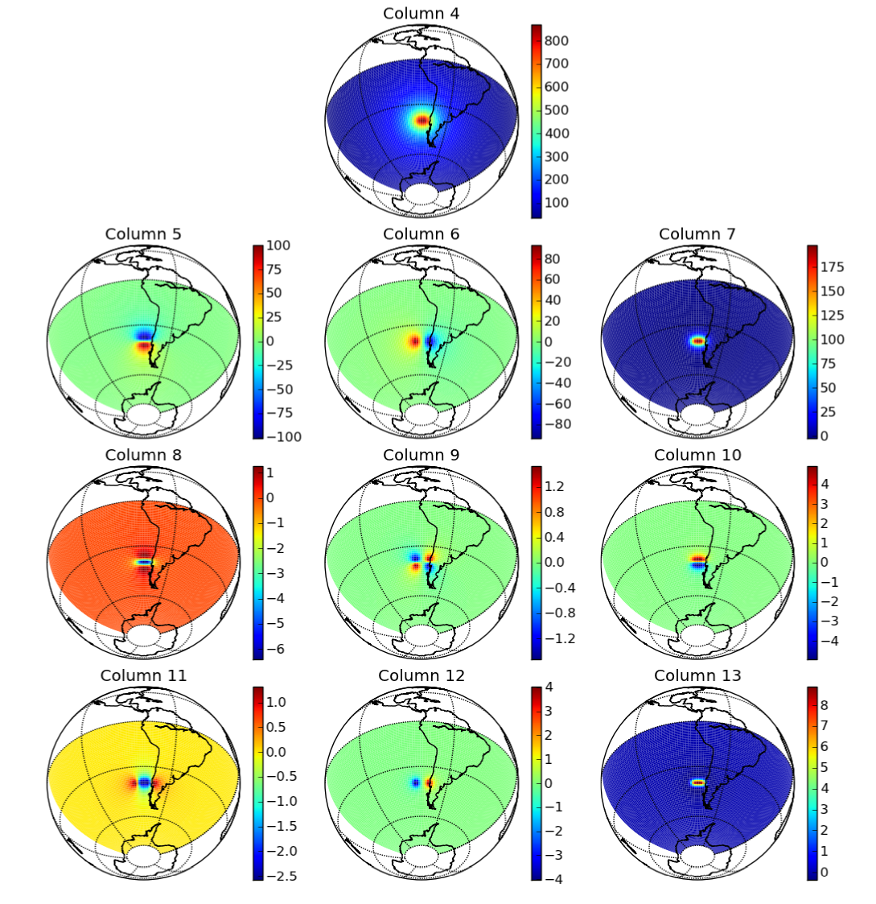

.. _recipe_tess2prism:

Convert a tesseroid model to prisms and calculate in spherical coordinates
==========================================================================

The ``tess2prism.sh`` script
converts a tesseroid model to prisms
(using ``tessmodgen``) and
calculates the gravitational potential, gravitational attraction,
and gravity gradient tensor
in spherical coordinates:

.. include:: ../../cookbook/tess2prism/tess2prism.sh
    :literal:

The tesseroid model file looks like this:

.. include:: ../../cookbook/tess2prism/tess-model.txt
    :literal:

and the converted prism model looks like this:

.. include:: ../../cookbook/tess2prism/sample-prism-model.txt
    :literal:

Note that the density of prisms is altered.
This is so that the tesseroid and corresponding prism have the same mass.

The result should look like the :ref:`following <tess2prism>`
("column" means the column of the output file).

.. _tess2prism:

    Plot of the columns of ``output.txt`` generated
    by ``tess2prism.sh``. Orthographic projection
    (thanks to the Basemap_ toolkit of matplotlib_).

.. _Basemap: http://matplotlib.github.com/basemap/index.html
.. _matplotlib: http://matplotlib.sourceforge.net/index.html
