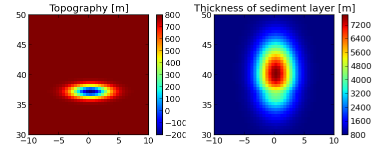
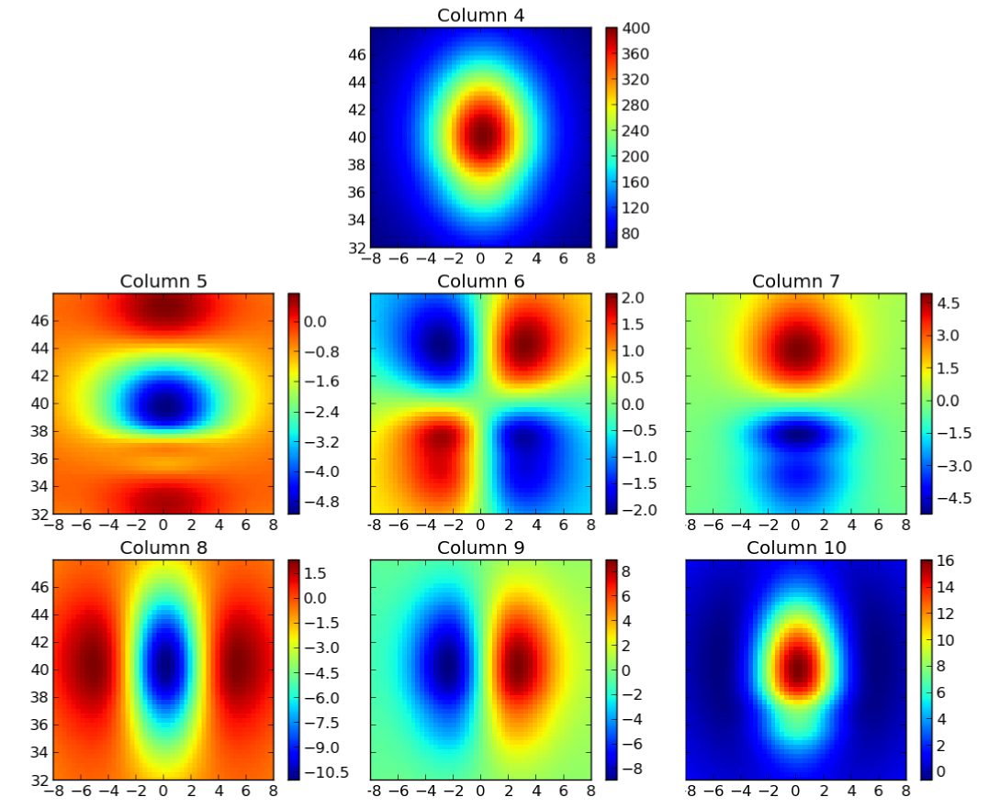

.. _recipe_tesslayers:

Using tesslayers to make a tesseroid model of a stack of layers
===============================================================

The ``tesslayers.sh`` script converts
grids that define a stack of layers
into a tesseroid model.
It then calculates
the gravitational attraction
and gravity gradient tensor due to the tesseroid model:

.. include:: ../../cookbook/tesslayers/tesslayers.sh
    :literal:

The input file ``layers.txt`` contains
the information about the stack of layers.
It is basicaly regular grids in xyz format (i.e., in columns).
The first 2 columns in the file are
the longitude and latitude
of the grid points.
Then comes a column with the height of the first layer.
This is the height (with respect to mean Earth radius)
of the top of stack of layers.
Then comes the thickness and density of each layer.
Our layer file looks like this:

.. include:: ../../cookbook/tesslayers/layers.txt
    :literal:
    :number-lines:
    :end-line: 10

...

.. include:: ../../cookbook/tesslayers/layers.txt
    :literal:
    :number-lines: 500
    :start-line: 500
    :end-line: 510

This is a synthetic layer model
generated from two gaussian functions.
:ref:`This <layers>` is what
the topography (height column)
and the thickness of the sediments
look like:

.. _layers:

    Plot of the third and forth columns of ``layers.txt``.
    The x and y axis are longitude and latitude, respectively.

The model file generated looks like this:

.. include:: ../../cookbook/tesslayers/tessmodel.txt
    :literal:
    :number-lines:
    :end-line: 10
...

.. include:: ../../cookbook/tesslayers/tessmodel.txt
    :literal:
    :number-lines: 500
    :start-line: 500
    :end-line: 510

The result should look like the :ref:`following <tesslayers>`
("column" means the column of the output file).

.. _tesslayers:

    Plot of the columns of ``output.txt`` generated by ``tesslayers.sh``.
    The x and y axis are longitude and latitude, respectively.
