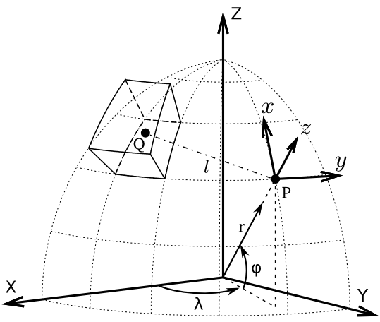
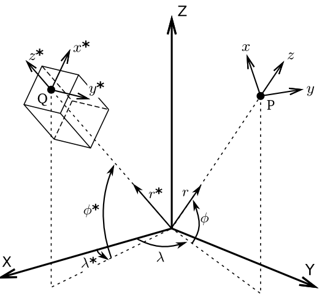
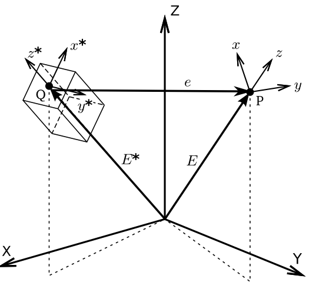

.. _theory:

Theorerical background
======================

What is a tesseroid anyway?
---------------------------

.. image:: _static/tesseroid.png
    :align: center
    :width: 300px

A tesseroid, or spherical prism,
is segment of a sphere.
It is delimited by:

1. 2 meridians, :math:`\lambda_1` and :math:`\lambda_2`

    .. image:: _static/tesseroid_meridians.png
        :align: center
        :width: 600px

2. 2 parallels, :math:`\phi_1` and :math:`\phi_2`

    .. image:: _static/tesseroid_parallels.png
        :align: center
        :width: 600px

3. 2 spheres of radii :math:`r_1` and :math:`r_2`

    .. image:: _static/tesseroid_sphere.png
        :align: center
        :width: 600px

About coordinate systems
------------------------

The figure bellow shows a tesseroid,
the global coordinate system (X, Y, Z),
and the local coordinate system (:math:`x,\ y,\ z`) of a point P.

.. _tess-coords:

    View of a tesseroid, the integration point Q,
    the global coordinate system (X, Y, Z),
    the computation P
    and it's local coordinate system (:math:`x,\ y,\ z`).
    :math:`r,\ \phi,\ \lambda` are
    the radius, latitude, and longitude, respectively,
    of point P.

The global system has origin on the center of the Earth
and Z axis aligned with the Earth's mean rotation axis.
The X and Y axis are contained on the equatorial parallel
with X intercepting the mean Greenwich meridian
and Y completing a right-handed system.

The local system has origin on the computation point P.
It's :math:`z` axis is oriented along the radial direction
and points away from the center of the Earth.
The :math:`x` and :math:`y` axis
are contained on a plane normal to the :math:`z` axis.
:math:`x` points North and :math:`y` East.

The gravitational attraction
and gravity gradient tensor
of a tesseroid
are calculated with respect to
the local coordinate system of the computation point P.

.. warning:: The :math:`g_z` component is an exception to this.
    In order to conform with the regular convention
    of z-axis pointing toward the center of the Earth,
    this component **ONLY** is calculated with an inverted z axis.
    This way, gravity anomalies of
    tesseroids with positive density
    are positive, not negative.

Gravitational fields of a tesseroid
-----------------------------------

The gravitational potential of a tesseroid
can be calculated using the formula

.. math::
    V(r,\phi,\lambda) = G \rho
        \displaystyle\int_{\lambda_1}^{\lambda_2}
        \displaystyle\int_{\phi_1}^{\phi_2}
        \displaystyle\int_{r_1}^{r_2}
        \frac{1}{\ell} \kappa \ d r' d \phi' d \lambda'

The gravitational attraction
can be calculated using the formula
(Grombein et al., 2010):

.. math::
    g_{\alpha}(r,\phi,\lambda) = G \rho
        \displaystyle\int_{\lambda_1}^{\lambda_2}
        \displaystyle\int_{\phi_1}^{\phi_2} \displaystyle\int_{r_1}^{r_2}
        \frac{\Delta_{\alpha}}{\ell^3} \kappa \ d r' d \phi' d \lambda'
        \ \ \alpha \in \{x,y,z\}

The gravity gradients can be calculated
using the general formula
(Grombein et al., 2010):

.. math::
    g_{\alpha\beta}(r,\phi,\lambda) = G \rho
        \displaystyle\int_{\lambda_1}^{\lambda_2}
        \displaystyle\int_{\phi_1}^{\phi_2} \displaystyle\int_{r_1}^{r_2}
        I_{\alpha\beta}({r'}, {\phi'}, {\lambda'} )
        \ d r' d \phi' d \lambda'
        \ \ \alpha,\beta \in \{x,y,z\}

.. math::
    I_{\alpha\beta}({r'}, {\phi'}, {\lambda'}) =
        \left(
            \frac{3\Delta_{\alpha} \Delta_{\beta}}{\ell^5} -
            \frac{\delta_{\alpha\beta}}{\ell^3}
        \right)
        \kappa\
        \ \ \alpha,\beta \in \{x,y,z\}

where :math:`\rho` is density,
:math:`\{x, y, z\}` correspond to the local coordinate system
of the computation point P
(see :ref:`the tesseroid figure <tess-coords>`),
:math:`\delta_{\alpha\beta}` is the `Kronecker delta`_, and

.. math::
   :nowrap:
   
    \begin{eqnarray*}
        \Delta_x &=& r' K_{\phi} \\
        \Delta_y &=& r' \cos \phi' \sin(\lambda' - \lambda) \\
        \Delta_z &=& r' \cos \psi - r\\
        \ell &=& \sqrt{r'^2 + r^2 - 2 r' r \cos \psi} \\
        \cos\psi &=& \sin\phi\sin\phi' + \cos\phi\cos\phi'
                     \cos(\lambda' - \lambda) \\
        K_{\phi} &=& \cos\phi\sin\phi' - \sin\phi\cos\phi'
                     \cos(\lambda' - \lambda)\\
        \kappa &=& {r'}^2 \cos \phi'
    \end{eqnarray*}

:math:`\phi` is latitude,
:math:`\lambda` is longitude, and
:math:`r` is radius.

.. note:: The **gravitational attraction** and **gravity gradient tensor**
    are calculated with respect to :math:`(x, y, z)`,
    the **local coordinate system**
    of the computation point P.

.. _Kronecker delta: http://en.wikipedia.org/wiki/Kronecker_delta

Numerical integration
---------------------

The above integrals are solved using the Gauss-Legendre Quadrature rule
(Asgharzadeh et al., 2007):

.. math::
    g_{\alpha\beta}(r,\phi,\lambda) \approx G \rho
        \frac{(\lambda_2 - \lambda_1)(\phi_2 - \phi_1)(r_2 - r_1)}{8}
        \displaystyle\sum_{k=1}^{N^{\lambda}}
        \displaystyle\sum_{j=1}^{N^{\phi}}
        \displaystyle\sum_{i=1}^{N^r}
        W^r_i W^{\phi}_j W^{\lambda}_k
        I_{\alpha\beta}({r'}_i, {\phi'}_j, {\lambda'}_k )
        \ \alpha,\beta \in \{1,2,3\}

where :math:`W_i^r`, :math:`W_j^{\phi}`, and :math:`W_k^{\lambda}`
are weighting coefficients
and :math:`N^r`, :math:`N^{\phi}`, and :math:`N^{\lambda}`
are the number of quadrature nodes
(i.e., the order of the quadrature),
for the radius, latitude, and longitude, respectively.

Gravitational fields of a prism in spherical coordinates
--------------------------------------------------------

The gravitational potential and its first and second derivatives
for the right rectangular prism
can be calculated in Cartesian coordinates
using the formula of Nagy et al. (2000).

However, several transformations have to made
in order to calculate the fields of a prism
in a global coordinate system
using spherical coordinates (see :ref:`this figure <prism-coordinates>`).

.. _prism-coordinates:

    View of a right rectangular prism
    with its corresponding local coordinate system
    (:math:`x^*,\ y^*,\ z^*`),
    the global coordinate system (X, Y, Z),
    the computation P
    and it's local coordinate system (:math:`x,\ y,\ z`).
    :math:`r,\ \phi,\ \lambda` are
    the radius, latitude, and longitude, respectively.

The formula of Nagy et al. (2000)
require that the computation point
be given in the Cartesian coordinates of the prism
(:math:`x^*,\ y^*,\ z^*` in :ref:`this figure <prism-coordinates>`).
Therefore, we must first transform
the spherical coordinates (:math:`r,\ \phi,\ \lambda`)
of the computation point P
into :math:`x^*,\ y^*,\ z^*`.
This means that we must convert vector :math:`\bar{e}`
(from :ref:`this other figure <prism-vectors>`)
to the coordinate system of the prism.
We must first obtain vector :math:`\bar{e}`
in the global Cartesian coordinates (X, Y, Z):

.. math::

    \bar{e}^g = \bar{E} - \bar{E}^*

where :math:`\bar{e}^g` is the vector :math:`\bar{e}`
in the global Cartesian coordinates and 

.. math::

    \bar{E} =
    \begin{bmatrix}
        r \cos\phi\cos\lambda \\
        r \cos\phi\sin\lambda \\
        r \sin\phi
    \end{bmatrix}

.. math::

    \bar{E}^* =
    \begin{bmatrix}
        r^* \cos\phi^*\cos\lambda^* \\
        r^* \cos\phi^*\sin\lambda^* \\
        r^* \sin\phi^*
    \end{bmatrix}

.. _prism-vectors:

    The position vectors
    involved in the coordinate transformations.
    :math:`\bar{E}^*` is the position vector of point Q
    in the global coordinate system,
    :math:`\bar{E}` is the position vector of point P
    in the global coordinate system,
    and :math:`\bar{e}` is the position vector of point P
    in the local coordinate system of the prism
    (:math:`x^*,\ y^*,\ z^*`).    

Next, we transform :math:`\bar{e}^g`
to the local Cartesian system of the prism by

.. math::

    \bar{e} = \bar{\bar{P}}_y \bar{\bar{R}}_y(90^\circ - \phi^*)
        \bar{\bar{R}}_z(180^\circ - \lambda^*)\bar{e}^g

where :math:`\bar{\bar{P}}_y` is a deflection matrix of the y axis,
:math:`\bar{\bar{R}}_y` and :math:`\bar{\bar{R}}_z` are
counterclockwise rotation matrices
around the y and z axis, respectively
(see `Wolfram MathWorld`_).

.. math::

    \bar{\bar{P}}_y =
    \begin{bmatrix}
    1 & 0 & 0\\
    0 & -1 & 0\\
    0 & 0 & 1\\
    \end{bmatrix}

.. math::

    \bar{\bar{R}}_y(\alpha) =
    \begin{bmatrix}
    \cos\alpha & 0 & \sin\alpha\\
    0 & 1 & 0\\
    -\sin\alpha & 0 & \cos\alpha\\
    \end{bmatrix}

.. math::

    \bar{\bar{R}}_z(\alpha) =
    \begin{bmatrix}
    \cos\alpha & -\sin\alpha & 0\\
    \sin\alpha & \cos\alpha & 0\\
    0 & 0 & 1\\
    \end{bmatrix}

Which gives us

.. math::

    \bar{e} =
    \begin{bmatrix}
    x\\y\\z
    \end{bmatrix}

.. note:: Nagy et al. (2000) use the z axis pointing down,
    so we still need to invert the sign of :math:`z`.

Vector :math:`\bar{e}` can then be used
with the Nagy et al. (2000) formula.
These formula give us the gravitational attraction
and the gravity gradient tensor
calculated with respect to the coordinate system of the prism
(i.e., :math:`x^*,\ y^*,\ z^*`).
However, we need them in
the coordinate system of the observation point P,
where they are measured by GOCE_ and
calculated for the tesseroids.
We perform these transformations via the global Cartesian system
(tip: the rotation matrices are orthogonal).
:math:`\bar{g}^*` is the gravity vector
in the coordinate system of the prism,
:math:`\bar{g}^g` is the gravity vector
in the global coordinate system,
and :math:`\bar{g}` is the gravity vector
in the coordinate system of computation point P.

.. math::

    \bar{g}^g =  
        \bar{\bar{R}}_z(\lambda^* - 180^\circ)
        \bar{\bar{R}}_y(\phi^* - 90^\circ)
        \bar{\bar{P}}_y
        \bar{g}^*

.. math::

    \bar{g} = \bar{\bar{P}}_y \bar{\bar{R}}_y(90^\circ - \phi)
        \bar{\bar{R}}_z(180^\circ - \lambda)\bar{g}^g

.. math::

    \bar{g} =
        \bar{\bar{P}}_y
        \bar{\bar{R}}_y(90^\circ - \phi)
        \underbrace{
            \bar{\bar{R}}_z(180^\circ - \lambda)
            \bar{\bar{R}}_z(\lambda^* - 180^\circ)
        }_{
            \bar{\bar{R}}_z(\lambda^* - \lambda)
        }
        \bar{\bar{R}}_y(\phi^* - 90^\circ)
        \bar{\bar{P}}_y
        \bar{g}^*

.. math::

    \bar{g} =
        \bar{\bar{R}}
        \bar{g}^*

.. math::

    \bar{\bar{R}} = 
        \bar{\bar{P}}_y
        \bar{\bar{R}}_y(90^\circ - \phi)
        \bar{\bar{R}}_z(\lambda^* - \lambda)
        \bar{\bar{R}}_y(\phi^* - 90^\circ)
        \bar{\bar{P}}_y

Likewise,
transformation for the gravity gradient tensor :math:`T` is

.. math::

    \bar{\bar{T}} = 
        \bar{\bar{R}}
        \bar{\bar{T}}^*
        \bar{\bar{R}}^T

        
.. _GOCE: http://www.esa.int/esaLP/ESAYEK1VMOC_LPgoce_0.html
.. _Wolfram MathWorld: http://mathworld.wolfram.com/RotationMatrix.html

Recommended reading
-------------------

* Smith et al. (2001)
* Wild-Pfeiffer (2008)

References
----------

Asgharzadeh, M. F., R. R. B. von Frese, H. R. Kim, T. E. Leftwich,
and J. W. Kim (2007),
Spherical prism gravity effects by Gauss-Legendre quadrature integration,
Geophysical Journal International, 169(1), 1-11,
doi:10.1111/j.1365-246X.2007.03214.x.

Grombein, T.; Seitz, K.; Heck, B. 2010.
`"Untersuchungen zur effizienten Berechnung topographischer Effekte
auf den Gradiententensor am Fallbeispiel der
Satellitengradiometriemission GOCE"
<http://digbib.ubka.uni-karlsruhe.de/volltexte/documents/1336300>`_.
KIT Scientific Reports 7547, ISBN 978-3-86644-510-9, KIT Scientific Publishing,
Karlsruhe, Germany.

Nagy, D., G. Papp, and J. Benedek (2000),
The gravitational potential and its derivatives for the prism,
Journal of Geodesy, 74(7-8), 552-560, doi:10.1007/s001900000116.

Nagy, D., G. Papp, and J. Benedek (2002),
Corrections to "The gravitational potential and its derivatives for the prism,"
Journal of Geodesy, 76(8), 475-475, doi:10.1007/s00190-002-0264-7.

Smith, D. A., D. S. Robertson, and D. G. Milbert (2001),
Gravitational attraction of local crustal masses in spherical coordinates,
Journal of Geodesy, 74(11-12), 783-795, doi:10.1007/s001900000142.

Wild-Pfeiffer, F. (2008),
A comparison of different mass elements for use in gravity gradiometry,
Journal of Geodesy, 82(10), 637-653, doi:10.1007/s00190-008-0219-8.


